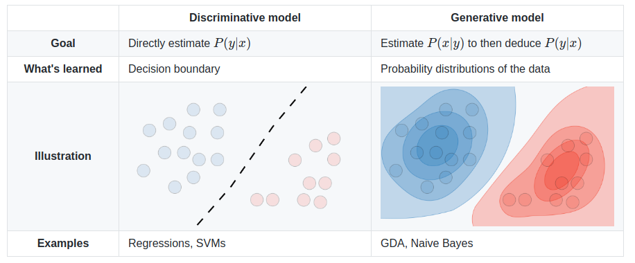

#### 机器学习

- 机器学习的目标：基于有限训练样本集尽可能估计出后验概率$P(y \mid x)$
- 机器学习的两种范式：

##### 无监督学习（unsupervised learning）的主要内容

- 聚类
  - 原型聚类
  - 密度聚类
  - 层次聚类
- 特征学习
  - 主成分分析（Principal Component Analysis）
  - 稀疏编码（sparse coding）
  - 自编码器（Auto-Encoder）
  - 稀疏编码器（Sparse Auto-Encoder）
  - 降噪编码器（Denoising Auto-Encoder）
- **概率密度估计**
  - 参数密度估计——假设数据服从某个已知概率密度函数形式的分布（比如高斯分布），然后根据训练样本去估计概率密度函数的参数。
  - 非参数密度估计——不假设数据服从某个已知分布，通过将样本空间划分为不同的区域并估计每个区域的概率来近似数据的概率密度函数。
    - 核密度估计（Kernel Density Estimation）
    - k近邻方法（K-Nearest Neighbor Method）

#### 概率生成模型（Probabilistic Generative Model）

概率生成模型（Probabilistic Generative Model），简称生成模型，是概率统计和机器学习领域的一类重要模型，指一系列用于随机生成可观测数据的模型。生成模型通常包含两个基本功能：**概率密度估计**和**生成样本（即采样）**。

##### 变分自编码器（Variational Auto-encoders，VAE）

##### 生成对抗网络（Generative Adversarial Nets，GAE）

##### 扩散模型（Diffusion Model，DM）

##### Denoising Diffusion Probabilistic Models（DDPM）

